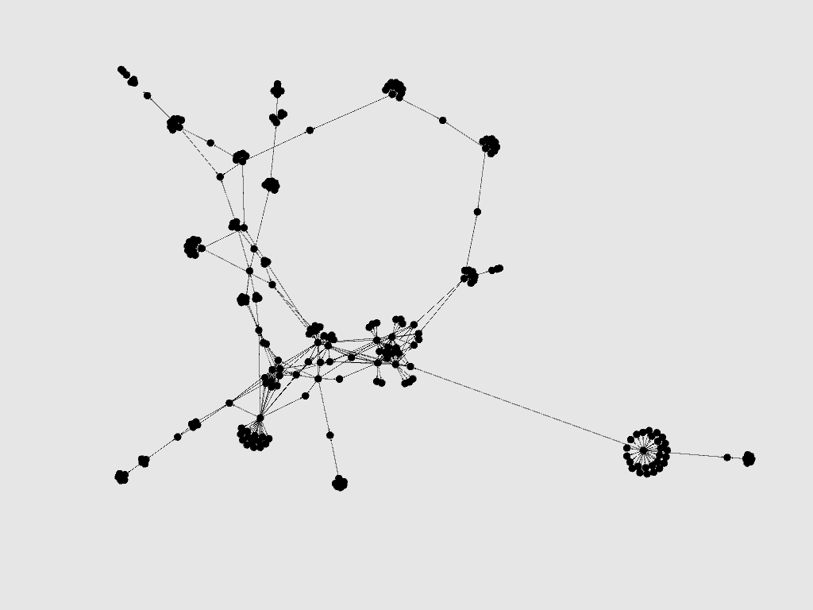

# Examine _This_: Using Network Analysis to Investigate the Structure of Technology

This repository houses an independent project geared at extracting insights into the relative importance of US  utility patents and analyzing underlying structure and relationship of those patents. Raw patent data utilized is taken from the databases made available by the [Fung Institute](https://github.com/funginstitute/downloads/blob/master/README.md) at UC Berkeley.

For an in-depth look into the motivation and methodology of the project, read on.

## Motivation
Aggressively managing an intellectual property portfolio has become an essential operation for most large companies. Vast resources are poured into identifying potentially profitable technological fields and evaluating which technologies may be more valuable over time. Effective use of patent data is one way to more thoroughly pursue an optimal IP portfolio, while minimizing the amount of human labor required.

Regardless of potential commercial value, the intellectual value of being able to look at the structure of technology and how it has shifted over time is, at least to this scientist, inherently interesting.
 

## Data

The data I used is sourced from a series of publicly available databases. Although the databases purport to contain only utility patents, there were a non-trivial number of patents that were formatted not in accordance with the [USPTO required formatting](https://www.uspto.gov/patents-application-process/applying-online/patent-number).  As such, part of my processing pipeline included extraction of just patents with numbers that were formatted in accordance with the standard for utility patents using `re` and `pandas` in python. My basic data processing file, which outputs one .csv file with all the ultimate utility patents can be found here:
`src/data_processing.py`.

It is worth noting that working with patent data in any reliable way requires some domain knowledge. The US patent system is archaic and, in many ways, broken. Further, it is unlike any other system that I've encountered. A review of the [USPTO primer](https://www.uspto.gov/patents-getting-started/general-information-concerning-patents) on the patent system or some other high-level overview should be undertaken before diving into patent analysis.

##  Analysis
Due to the computation intensity of network analysis, I utilized the GraphX which is Apache Spark's API for graphs and graph-parallel computation. Although some of the computation could be done locally, I ran a Spark Cluster on Amazon EC2. Here are the resources I relied on to [install Spark](https://github.com/zipfian/spark-install) and how to run it [using AWS](https://github.com/zipfian/spark-aws).

My primary investigation involved extracting patents with the highest pagerank centrality, over time.

In addition, I utilized [Gephi](https://gephi.org/) to create visualizations of subsets of the patent citation network and breakdown those graphs into communities.

For example, here is a representations of all patents, from 1975 - 1980, with primary classification 707 (which relates to database management).

 

## Next Steps

Although this project was inherently exploratory, what I've produced barely scratches the surface of what's possible with my data and the technologies I've utilized. In the near future, I plan to:
- Create dynamic visualizations showing the shift in patent subclasses over time
- Figure out how to extract information from Class 1 (classification given to patents that don't currently fit into the classification structure in place at the time the patent was granted)
